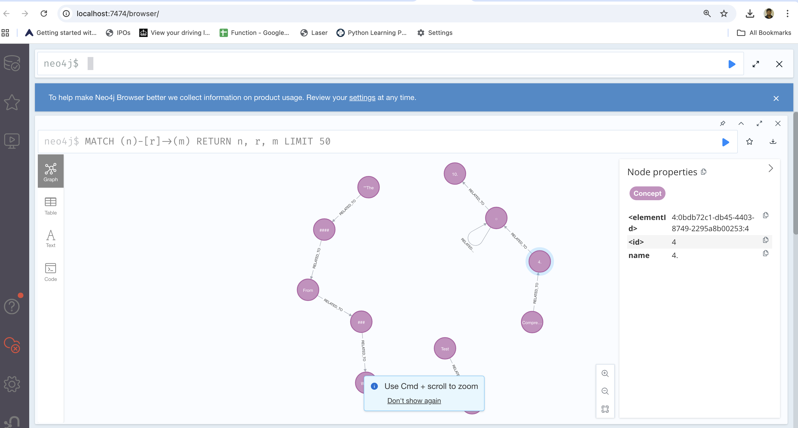

# Document QA App with Interactive Knowledge Graph

A powerful AI-powered application that lets you upload documents, ask questions, and explore knowledge through interactive visualizations. Perfect for researchers, students, and anyone who wants to quickly understand and explore document content.

## 🌟 What This App Does

- **Upload Documents**: Support for PDF, text, code, and data files
- **Ask Questions**: Get AI-powered answers about your documents
- **Visual Knowledge Graph**: See how concepts connect in your documents
- **Persistent Storage**: Your data stays available between sessions
- **Interactive Exploration**: Click and explore document chunks and relationships
- **Smart UI**: Intuitive interface with loading states and clear feedback

## 📋 Supported File Types

- **Documents**: PDF, TXT, Markdown (.md)
- **Code Files**: Python (.py), JavaScript (.js), HTML (.html), CSS (.css)
- **Data Files**: JSON (.json), XML (.xml)

## 🚀 Quick Start Guide

### Step 1: Install Required Software

#### 1.1 Install Python (3.11 or newer)
- **Windows**: Download from [python.org](https://www.python.org/downloads/)
- **Mac**: Use Homebrew: `brew install python@3.11`
- **Linux**: `sudo apt install python3.11` (Ubuntu/Debian)

#### 1.2 Install Node.js (16 or newer)
- **All Platforms**: Download from [nodejs.org](https://nodejs.org/)
- **Mac**: `brew install node`
- **Linux**: `sudo apt install nodejs npm`

#### 1.3 Install Docker
- **All Platforms**: Download from [docker.com](https://www.docker.com/products/docker-desktop/)
- **Mac**: `brew install --cask docker`
- **Linux**: Follow [Docker installation guide](https://docs.docker.com/engine/install/)

#### 1.4 Install Poetry (Python package manager)
```bash
curl -sSL https://install.python-poetry.org | python3 -
```

#### 1.5 Install Ollama (AI model runner)
```bash
# Mac/Linux
curl -fsSL https://ollama.com/install.sh | sh

# Windows: Download from ollama.com
```

### Step 2: Download and Setup the App

1. **Clone or download this project**
2. **Open terminal/command prompt in the project folder**

### Step 3: Start Required Services

#### 3.1 Start Neo4j Database
```bash
docker run -d --name neo4j \
  -p 7474:7474 \
  -p 7687:7687 \
  -e NEO4J_AUTH=neo4j/Test1234 \
  neo4j:latest
```

#### 3.2 Download AI Model
```bash
ollama pull phi3
```

### Step 4: Install App Dependencies

#### 4.1 Backend Setup
```bash
cd src/backend
poetry install
```

#### 4.2 Frontend Setup
```bash
cd src/frontend
npm install
```

### Step 5: Run the Application

#### 5.1 Start Backend (Terminal 1)
```bash
cd src/backend
poetry run uvicorn main:app --reload --host 0.0.0.0 --port 8000
```

#### 5.2 Start Frontend (Terminal 2)
```bash
cd src/frontend
npm start
```

### Step 6: Access the App
- **Main App**: Open [http://localhost:3000](http://localhost:3000) in your browser
- **API Documentation**: [http://localhost:8000/docs](http://localhost:8000/docs)
- **Database Browser**: [http://localhost:7474](http://localhost:7474) (neo4j/Test1234)

## 🎯 How to Use

### 1. Upload a Document
- Click "Choose File" and select any supported document
- See file selection confirmation and upload button becomes enabled
- Click "Upload Document" (shows "Uploading..." while processing)
- File input clears automatically after successful upload

### 2. Ask Questions
- Type your question in the text box
- Click "Ask Question" (button is disabled while processing)
- Get AI-powered answers based on your uploaded documents
- Relevant concepts are highlighted in the knowledge graph

### 3. Explore Data
- Click "View Chunks & Knowledge Graph" to see:
  - Document chunks (text segments)
  - Interactive knowledge graph showing concept relationships

### 4. Visual Exploration
- Click and drag nodes in the knowledge graph
- Zoom in/out to explore relationships
- Relevant concepts are highlighted when you ask questions

## 🔧 Troubleshooting

### Common Issues and Solutions

#### "Port already in use" Error
- **Solution**: Stop other applications using ports 3000, 8000, 7474, or 7687
- **Check**: `lsof -i :3000` (Mac/Linux) or `netstat -ano | findstr :3000` (Windows)

#### "Module not found" Error
- **Solution**: Make sure you're in the correct directory and ran `poetry install`
- **Check**: `poetry --version` should work

#### "Docker not running" Error
- **Solution**: Start Docker Desktop application
- **Check**: `docker ps` should show running containers

#### "Ollama model not found" Error
- **Solution**: Run `ollama pull phi3` to download the AI model
- **Check**: `ollama list` should show phi3 model

#### App won't start
- **Solution**: Make sure all services are running:
  - Neo4j: `docker ps | grep neo4j`
  - Backend: Check terminal for "Application startup complete"
  - Frontend: Check terminal for "Compiled successfully"

### Getting Help

1. **Check the logs** in your terminal windows
2. **Verify all services** are running (see Step 5)
3. **Restart services** if needed:
   - Backend: Ctrl+C, then run the uvicorn command again
   - Frontend: Ctrl+C, then run `npm start` again
   - Neo4j: `docker restart neo4j`

## 🏗️ Technical Details

### Architecture
- **Frontend**: React 18 with modern UI components
- **Backend**: FastAPI with automatic API documentation
- **AI**: Ollama with Phi-3 model for question answering
- **Vector Database**: ChromaDB for document embeddings
- **Graph Database**: Neo4j for knowledge graph storage
- **Document Processing**: LangChain for text chunking and processing

### Key Features
- **Multi-format Support**: PDF, TXT, MD, PY, JS, HTML, CSS, JSON, XML
- **Persistent Storage**: Data survives app restarts
- **Real-time Processing**: Instant document analysis with loading indicators
- **Interactive Visualization**: Dynamic knowledge graph exploration
- **AI-Powered QA**: Context-aware question answering
- **Smart UI**: Button states, file selection feedback, and clear error handling
- **Security**: Protection against malicious inputs and script injection

### File Structure
```
graphkg-rag-demo/
├── src/
│   ├── backend/           # Python FastAPI backend
│   │   ├── main.py       # Main application
│   │   ├── utils.py      # Document processing
│   │   └── kg_db.py      # Database operations
│   └── frontend/         # React frontend
│       ├── src/
│       │   ├── App.jsx   # Main component
│       │   └── App.css   # Styling
│       └── public/
│           └── index.html
├── pyproject.toml        # Python dependencies
└── README.md            # This file
```

## 🔄 Data Persistence

Your uploaded documents and knowledge graphs are automatically saved and will be available the next time you start the app. No need to re-upload documents!

## ✨ Recent Features

### Enhanced User Experience
- **Smart button states**: Upload button disabled until file selected, Ask button disabled while processing
- **Loading indicators**: Clear feedback during document processing and question answering
- **File selection feedback**: Visual confirmation when files are selected
- **Auto-clear inputs**: File input clears after successful upload

### Security Improvements
- **Input validation**: Protection against malicious inputs and script injection
- **Safe processing**: Script tags and JavaScript code are handled securely
- **Error handling**: Clear error messages for unsupported file types

## 🔍 Exploring Knowledge Graphs with Neo4j

### Access Neo4j Browser
- **URL**: [http://localhost:7474](http://localhost:7474)
- **Login**: `neo4j` / `Test1234`

### What Knowledge Graphs Look Like
Here's an example of how your knowledge graph relationships appear in the Neo4j Browser:



*This shows the interconnected concepts and relationships extracted from your uploaded documents*

### Essential Queries

#### 1. **View All Concepts and Relationships**
```cypher
MATCH (n)-[r]->(m) 
RETURN n, r, m 
LIMIT 50
```

#### 2. **Count Total Nodes and Relationships**
```cypher
MATCH (n) RETURN count(n) as total_nodes;
MATCH ()-[r]->() RETURN count(r) as total_relationships;
```

#### 3. **Find Most Connected Concepts**
```cypher
MATCH (n:Concept)-[r]-() 
RETURN n.name as concept, count(r) as connections 
ORDER BY connections DESC 
LIMIT 10
```

#### 4. **View All Concept Names**
```cypher
MATCH (n:Concept) 
RETURN n.name as concept_name 
ORDER BY n.name
```

#### 5. **Find Shortest Path Between Concepts**
```cypher
MATCH (a:Concept {name: 'concept1'}), (b:Concept {name: 'concept2'}), 
      path = shortestPath((a)-[*]-(b)) 
RETURN path
```

#### 6. **Show Full Graph (Small Datasets)**
```cypher
MATCH (n)-[r]->(m) 
RETURN n, r, m
```

#### 7. **Find Isolated Concepts**
```cypher
MATCH (n:Concept) 
WHERE NOT (n)-[]-() 
RETURN n.name as isolated_concept
```

#### 8. **Graph Statistics**
```cypher
MATCH (n) 
WITH labels(n) as nodeLabels, count(n) as nodeCount 
UNWIND nodeLabels as label 
RETURN label, sum(nodeCount) as count 
ORDER BY count DESC
```

### Pro Tips
- **Start with queries 1-4** to get familiar with your data
- **Use query 3** to find the most important concepts
- **Query 5** is great for finding connections between specific concepts
- **Query 6** shows the full graph but may be slow with large datasets
- **Switch between Table and Graph views** in Neo4j Browser for different visualizations

## 🎨 Customization

### Changing AI Model
Edit `src/backend/main.py` and change `model="phi3"` to another Ollama model:
```python
llm = Ollama(model="llama2")  # or any other model
```

### Adjusting Text Chunking
Edit `src/backend/utils.py` to change chunk size:
```python
splitter = RecursiveCharacterTextSplitter(chunk_size=1000, chunk_overlap=100)
```